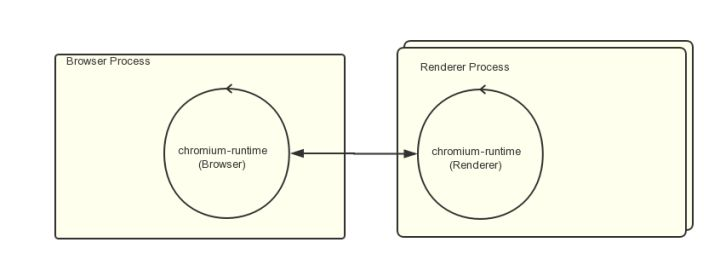
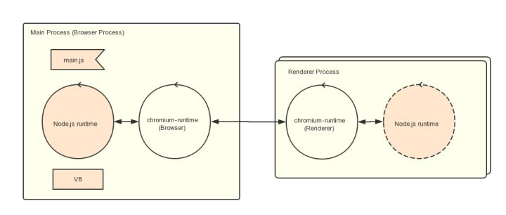
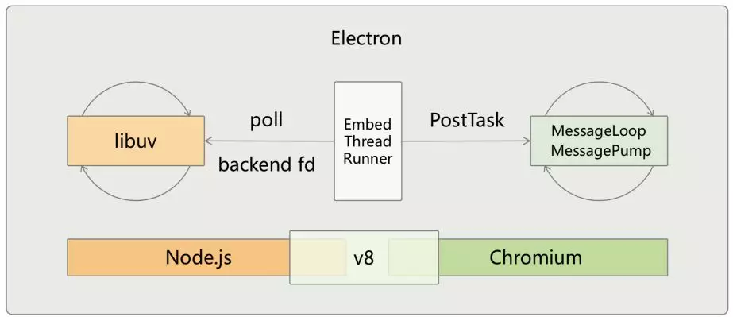

# 从零搭建Electron应用 的一系列简单的 Demo

Electron 是一个优秀的跨平台桌面应用程序开源库，目前接触 Electron 的开发者也越来越多。但是笔者发现，目前社区里缺少对初学者足够友好的入门教程来帮助初学者用 Electron 搭建一个完整的开发框架。

为了解决这个问题，笔者将结合平时的一些 Electron 开发经验，渐近式的带领读者从零开始搭建一个完整的 Electron 应用。在这个教程中，笔者将使用 React 构建渲染进程。当然，读者也可以用其他框架来构建渲染进程，各种前端框架脚手架已经足够友好，所以这一点不用担心。

阅读完这篇教程，读者将会了解到：
  - Electron的核心知识点
  - 如何搭建一个最简单的 Electron
  - 如何将 Electron 和前端应用相结合
  - 如何配置 TypeScript 以保证代码质量
  - 如何跨平台打包 Electron 应用
  - 如何调试 Electron

笔者将通过以下 8 个小 Demo 来介绍上面的知识点，为了保证学习质量，建议读者手把手跟着练习这些 Demo，读者可以[点击这里](https://github.com/WangYuLue/electron-demos)来下载项目代码。

- 搭建一个最简单的Electron
- 从零搭建一个React应用（TypeScript,Scss,热更新）
- 将 Electron 与 React 结合
- 打包 Electron 应用
- 实际开发一个小 Demo
- 主进程使用 TypeScript 构建
- 主进程监听文件变化并重启
- 在 vscode 中调试主进程和渲染进程

在开始之前，我们先聊一聊 Electron 的基础概念

## Electron 基础概念

### Electron 是什么？

Electron 是一个可以用 JavaScript、HTML 和 CSS 构建桌面应用程序的库。这些应用程序能打包到 Mac、Windows 和 Linux 系统上运行，也能上架到 Mac 和 Windows 的 App Store。

### Electron 由什么组成？

Electron 结合了 Chromium、Node.js 以及 操作系统本地的 API（如打开文件窗口、通知、图标等）。


### 一些历史

- 2013年4月Atom Shell 项目启动 。

- 2014年5月Atom Shell 被开源 。

- 2015年4月Atom Shell 被重命名为 Electron 。

- 2016年5月Electron 发布了 v1.0.0 版本 。

- 2016年5月Electron 构建的应用程序可上架 Mac App Store 。

- 2016年8月Windows Store 支持 Electron 构建的应用程序 。

### Electron 基础架构

> Electron 与 Chromium 在架构上很相似

Chromium运行时有一个 `Browser Process`，以及一个或者多个 `Renderer Process`。

`Renderer Process` 顾名思义负责渲染Web页面。`Browser Process` 则负责管理各个 `Renderer Process` 以及其他部分（比如菜单栏，收藏夹等等），如下图：



在 Electron中，结构仍然类似，不过这里是一个 `Main Process` 管理多个 `Renderer Process`。



而且在 `Renderer Process` 可以使用 `Node.js` 的 API，这就赋予来 Electron 极大的能力，以下是主进程以及渲染进程可以访问到的API：


### 如何将 Chromium 与 Node 整合

Electron 最让人兴奋的地方在于 Chromium 与 Node 的整合。通俗的讲，我们可以在 Chromium 的控制台上做任何 Node 可以做的事。

能够做这个整合，首先得益于 Chromium 和 Node.js 都是基于 v8 引擎来执行 js 的，所以给了一种可能，他们是可以一起工作的。

但是有一个问题，Chromium 和 Node.js 的事件循环机制不同。我们知道，Node.js 是基于 libuv 的，Chromium 也有一套自己的事件循环方式，要让他们一起工作，就必须整合这两个事件循环机制。



如上图所示，Electron 采用了这样一种方式，它起了一个新的线程轮询 libuv 中的 backend fd，从而监听 Node.js 中的事件，一旦发现有新的事件发生，就会立即把它 post 到 Chromium 的事件循环中，唤醒主线程处理这个事件。

### Electron 与 NW.js 的对比以及区别

和 Electron 同样出名的跨平台桌面应用开源库还有 NW.js。他们都有非常出名的应用，例如用Electron开发的有 vscode，用 NW.js 开发的有钉钉。

`Electron` 的原名叫 `Atom Shell`，`NW.js`  的原名叫 `node-webkit`；他们起初是同一个作者开发，而且这个这个作者是国人，先向[大佬](https://github.com/zcbenz)致敬，为我们开源这么优秀的开源工具。后来种种原因分为两个产品，一个命名为 `NW.js`(英特尔公司提供技术支持)、 另一命名为 `Electron`(Github 公司提供技术支持)。

#### 两者在GitHub上的数据对比

```
nw.js    (36.7k star,  4051 commits, 256 releases,  748 open issues,  5862 closed)
electron (81.7k star, 23364 commits, 849 releases, 1047 open issues, 11612 closed)
```
可以看出 `Electron` 更加活跃。

#### 两者程序的入口不同
在 `NW.js` 中，应用的主入口是网页或者JS脚本。 你需要在 `package.json` 中指定一个html或者js文件，一旦应用的主窗口(在html作为主入口点的情况下)或脚本被执行，应用就会在浏览器窗口打开。

在 `Electron` 中，入口是一个 `JavaScript` 脚本。 不同于直接提供一个URL，**你需要手动创建一个浏览器窗口**，然后通过 API 加载 HTML 文件。 你还可以监听窗口事件，决定何时让应用退出。

Electron 的工作方式更像 Node.js 运行时 ，Electron 的 APIs 更加底层。

#### Node 集成
在 `NW.js`，网页中的 Node 集成需要通过给 `Chromium` 打补丁来实现。但在 `Electron` 中，我们选择了另一种方式：通过各个平台的消息循环与 `libuv` 的循环集成，避免了直接在 `Chromium` 上做改动。这就意味着 `Electron` 迭代的成本更低。


## 准备工作

有了上面这些基础概念，接下来开始将下面 8 个 Demo 的学习。

在开始之前，我们先做一些基础的准备，

安装依赖:

```bash
yarn

# or

npm install
```

为了防止意外报错，我们约定 `cd` 到每个 demo 里来运行相应 `package.json` 中的脚本。

以下的 demo 都将基于 Electron 8.0.0 版本讲解。

## Demo01: 搭建一个最简单的 Electron

首先，我们会搭建一个最简单的 Electron 应用，它只有 3 个文件，[点这里](https://github.com/WangYuLue/electron-demos/tree/master/demo01)查看Demo01代码

创建 `demo01` 目录：

1、新建 `package.json` 文件

```json
{
  "name": "demo01",
  "version": "1.0.0",
  "main": "main.js",
  "scripts": {
    "start": "../node_modules/.bin/electron ."
  }
}
```

2、新建 `index.html` 文件

```html
<!DOCTYPE html>
<html>
  <head>
    <meta charset="UTF-8">
    <title>Hello World!</title>
  </head>
  <body>
    <h1>Hello World!</h1>
    We are using node <script>document.write(process.versions.node)</script>,
    Chrome <script>document.write(process.versions.chrome)</script>,
    and Electron <script>document.write(process.versions.electron)</script>.
  </body>
</html>
```

3、新建 `main.js` 文件

```js
const { app, BrowserWindow } = require('electron')

function createWindow () {   
  // 创建浏览器窗口
  let win = new BrowserWindow({
    width: 800,
    height: 600,
    webPreferences: {
      nodeIntegration: true
    }
  })

  // 加载index.html文件
  win.loadFile('index.html')
}

app.whenReady().then(createWindow)
```

运行 `yarn start`，第一个 electron 项目就轻松启动起来了。

注意 `package.json` 中的 `main` 字段，它指定了 electron 的入口文件。

在 `main.js` 中，我们注意到，`electron` 模块所提供的功能都是通过命名空间暴露出来的。 比如说： `electron.app` 负责管理 `Electron` 应用程序的生命周期， `electron.BrowserWindow` 类负责创建窗口。

细心的同学注意到，Demo01 其实是 Electorn 官方文档中的[范例](https://www.electronjs.org/docs/tutorial/first-app)；是的，官方的范例写的非常简单友好，所以用它来作为我们一系列 Demo 的开始是非常好的选择。

## Demo02: 从零搭建一个React应用

在 Demo02 中，我们会做一件与 Electron 无关事情 —— 从零搭建一个 React 应用。

在这个 React 应用中，我们将支持 TypeScript、Scss、热更新。

虽然说有 `create-react-app` 这样的的官方脚手架可以快速搭建项目，但是从零搭建可以将项目尽可能的在自己的掌控范围之内。

由于这个 Demo 与 本教程的主题无关，所以这边就不展开讲了，只展现一下 Demo 的目录结构：

```
demo
└─src
  ├─index.tsx
  └─container
    └─App
      ├─index.tsx
      └─index.scss
├─index.html
├─package.json
├─tsconfig.json
└─webpack.config.js
```

对这个 Demo 感兴趣的同学可以查看[Demo02代码](https://github.com/WangYuLue/electron-demos/tree/master/demo02)

以下是这个 Demo 必要的相关依赖安装:

```bash
# 安装 webpack 相关依赖
yarn add webpack webpack-cli webpack-dev-server -D
yarn add html-webpack-plugin -D 
# 安装 typescript 相关依赖
yarn add typescript ts-loader -D
# 安装 react 相关依赖
yarn add react react-dom
yarn add @types/react @types/react-dom -D
# 安装 scss 相关依赖
yarn add sass-loader node-sass -D
yarn add style-loader css-loader -D
```

## Demo03: 将 Electron 与 React 结合

众所周知，前端项目在浏览器运行，而 Electron 是在桌面环境中运行。

在 Demo03 中，我们将尝试在 Electron 运行 React 项目。在开发环境中，Electron 将引用 React 开发环境下的 URL，以保证获得 React 热更新的能力，这也是我们在这个 Demo 中要做的事情。

在下一个 Demo 中，我们还会讲到在 Electron 打包后，Electron 将引用 React 打包后的文件，以获得更好的性能。我们先来看这个 Demo。

首先，拷贝 Demo02 文件夹，将其改名为 Demo03，并进入 Demo03：

1、将 Demo01 中的 `main.js` 也拷贝过来，将 `main.js` 中的 `createWindow` 修改如下：

```diff
  function createWindow() {
    // 创建浏览器窗口
    let win = new BrowserWindow({
      width: 800,
      height: 600,
      webPreferences: {
        nodeIntegration: true
      }
    })

+   win.loadURL('http://localhost:3000')
-   win.loadFile('index.html')
  }
```

这样 Electron 就可以加载 React 开发环境项目了。

2、在 `package.json` 中将 `script`改成：
```js
{
  "start-electron": "../node_modules/.bin/electron .",
  "start": "../node_modules/.bin/webpack-dev-server --config webpack.config.js"
}
```

其中 `start` 启动 React 项目，`start-electron` 启动 Electron 项目。

3、在 `webpack.config.js` 中的 `devServer` 里添加 `after` 钩子函数，以便在运行 react 项目后拉起 electron 项目：
```js
{
  after() {
    spawn('npm', ['run', 'start-electron'], {
      shell: true,
      env: process.env,
      stdio: 'inherit'
    })
      .on('close', code => process.exit(code))
      .on('error', spawnError => console.error(spawnError));
  }
}
```

经过以上配置后，运行 `yarn start` 就可以同时把 React 项目 和 Electron 都启动起来了。

Demo03 详细的代码可以[戳这里](https://github.com/WangYuLue/electron-demos/tree/master/demo03)查看。

## Demo04: 打包 Electron 应用

在上面的Demo中，我们简单搭建了开发环境的项目配置，但是读者的心里可能还没底，它在打包后还能正常运行吗？

有过前端开发经验的同学就会知道，很多时候，明明开发环境项目运行的很好，但是一打包之后就出问题了。不是路径引用错误就是 找不到 icon。所以，为了打消同学们的顾虑，我们将在 Demo04 中实践如何打包 Demo03 中的项目。

首先，拷贝 Demo03 文件夹，将其改名为 Demo04，并进入 Demo04：

在开始之前，笔者先简单介绍一下 Electron 主流的两款打包工具 [electron-packager](https://github.com/electron/electron-packager) 和 [electron-builder](https://github.com/electron-userland/electron-builder)。

`electron-builder` 在社区相对更加活跃，而且笔者项目实际开发中用的也是 `electron-builder` ，于是我们在这个demo中也用 `electron-builder` 来打包 Electron。

1、由于打包需要当前目录有 Electron 可执行文件，所以所以首先安装 Electron

```
yarn add electron@8.0.0 -D
```

2、在 `package.json` 中加入 `build` 字段，这个字段会告诉 `electron-builder` 如何来打包应用。

```json
"build": {
  "productName": "electron-demos",
  "files": [
    "dist/",
    "main.js"
  ],
  "dmg": {
    "contents": [
      {
        "x": 110,
        "y": 150
      },
      {
        "x": 240,
        "y": 150,
        "type": "link",
        "path": "/Applications"
      }
    ]
  },
  "win": {
    "target": [
      {
        "target": "nsis",
        "arch": [
          "x64"
        ]
      }
    ]
  },
  "directories": {
    "output": "release"
  }
}
```

其中，要重点关注 `files` 字段，它指定了打包时要包括的文件。在这个 demo 中，我们需要包括主进程的 `main.js` 和渲染进程需要的React项目打包后的 `dist` 文件夹。

此外，再关注一下 `directories.output` 字段，它表示 Electron 打包后的输出目录，如果不配置，默认为 `dist`，但是这和我们 React 项目的输出目录冲突，所以在这里我们改为 `release`。

关于 `electron-builder` 的详细配置，干兴趣的同学可以查看[文档](https://www.electron.build/configuration/configuration)。

3、修改 `package.json` 中的 `scripts` 字段。

3.1、修改 `start-electron` 命令，通过 `corss-env` 为其添加 `ENV` 环境变量：

```json
"start-electron": "../node_modules/.bin/cross-env ENV=development ../node_modules/.bin/electron .",
```

这么做是因为 Electron 接下来要通过这个环境变量来判断此时是开发环境还是生产环境，从而做出不同的行为。

3.2、添加 `build-render` 命令：

```json
"build-render": "../node_modules/.bin/webpack --config webpack.config.js"
```

它会打包 React 项目，并且在当前目录下生成 dist 输出文件。

3.3、添加 `build-electron` 命令：

```json
"build-electron": "../node_modules/.bin/electron-builder build -mwl",
```

它会读取 `package.json` 下 `build` 字段中的配置，并打包 Electron 项目，然后在当前目录下生成 release 输出文件。

命令中的 `-mwl` 表示打包 `mac`、`windows`、`linux` 三平台。如果读者只想打包一个平台的包，比如 Mac 版的，可以改成 `-m`。 

3.4、添加 `build` 命令：

```json
"build": "npm install && npm run build-render && npm run build-electron"
```

`build` 命令很简单，它将安装依赖、打包 React 项目、打包 Electron 项目结合在以前，这样的话，我们只要运行 `yarn build` 就能成功打包 Electron 了。

4、上面提到，由于此时demo要兼顾开发环境和生产环境，在开发环境中，Electron 要引用 React 开发环境下的 URL，以获得 React 热更新的能力。在生产环境中，Electron 要引用 React 打包后的文件。所以，我们要对 `main.js` 做一些微小的改造。

```diff
    const { app, BrowserWindow } = require('electron')
+   const path = require('path');

+   const isDev = process.env.ENV === 'development';

    function createWindow() {
      // 创建浏览器窗口
      let win = new BrowserWindow({
        width: 800,
        height: 600,
        webPreferences: {
          nodeIntegration: true
        }
      })

-     win.loadURL('http://localhost:3000')

+     if (isDev) {
+       win.loadURL(`http://localhost:3000`);
+     } else {
+       win.loadFile(path.resolve(__dirname, './dist/index.html'));
+     }
    }

    app.whenReady().then(createWindow)
```

我们可以看到，此时我们根据此时的环境来加载不同的资源，开发环境加载 `http://localhost:3000`，生产环境加载打包后的文件。

经过以上配置后，运行 `yarn build` 我们就可以打包 Electron 项目了。

Demo04 详细的代码可以[戳这里](https://github.com/WangYuLue/electron-demos/tree/master/demo04)查看。

## Demo05: 实际开发一个小 Demo

上面的四个 Demo 中，我已经体验了从零开始Electron项目到成功打包一个Electron的完整过程。

但是我们上面做的无非是在 Electron 中套一个可以在浏览器中跑的项目，到目前为止，我们还没有体验到 Electron 其他能力，例如：

- 调用 Node.js 的 API（如文件读写）
- 调用操作系统本地功能的 API（如打开文件窗口、通知）

在 Demo05 中，笔者将带领读者完成一个非常简单的文件读写应用，它将支持以下功能：

- 列出指定目录下的文件列表
- 支持在指定目录中添加文件
- 文件添加成功后调用系统的通知功能

此外，在这个 Demo 中，我们还会测试主进程与渲染进程之间的通信功能。

**需要注意的是，Demo05的 React 项目将无法在浏览器上运行，因为此时 React 会有很多 node 代码，而浏览器中并没有对应的 API。**

首先，拷贝 Demo04 文件夹，将其改名为 Demo05，并进入 Demo05：


1、由于接下来会在我们的 React 项目中加入大量的 node 代码，比如 `require('fs')`,这样的话原来 React 的 webpack 配置运行后肯定会报错，幸运的是，webpack 贴心的为我们准备了 Electron 的相关配置项。

我们可以在 `webpack.config.js` 中的里添加 `target` 字段，以表示接下来 React 的运行环境将在 Electron 的 render 进程中：
```js
{
  target: 'electron-renderer'
}
```

关于 `webpack` 的 `target` 字段的配置，感兴趣的同学可以阅读[官方文档](https://webpack.js.org/configuration/target/)。

2、接下来我们将在 React 项目中添加一个组件，用它来查看文件列表并添加新的文件：

在 Demo05 中新建 `src/container/file-list` 目录，并添加 [index.tsx](https://github.com/WangYuLue/electron-demos/blob/master/demo05/src/container/file-list/index.tsx) 文件：

```tsx
import React, { Component } from 'react';
import { remote, OpenDialogReturnValue } from 'electron';
import './index.scss';

const path = require("path");
const fs = require('fs');
const { dialog, Notification } = remote;

const readDistFiles = (path: string, callBack: (data: string[]) => void) => {
  fs.readdir(path, (err: any, files: any) => {
    const data: string[] = [];
    files.forEach((file: any) => {
      console.log(file);
      data.push(file);
    });
    if (callBack) {
      callBack(data);
    }
  })
}

interface IState {
  path: string;
  data: string[];
  addFileName: string;
  addFileContent: string;
}

class FileList extends Component<any, IState> {
  constructor(props: any) {
    super(props);
    this.state = {
      path: '',
      data: [],
      addFileName: '',
      addFileContent: '',
    }
  }

  onChooseFile = () => {
    dialog.showOpenDialog({
      properties: ['openDirectory']
    }).then((res: OpenDialogReturnValue) => {
      const filenames = res.filePaths;
      if (filenames && filenames.length > 0) {
        this.setState({ path: filenames[0] })
        readDistFiles(filenames[0], (data: string[]) => {
          console.log('data', data);
          this.setState({ data })
        })
      }
    });
  }

  onAppendFile = (name: string, content: string) => {
    fs.appendFile(path.resolve(this.state.path, name), content, (err: any) => {
      if (err) throw err;
      console.log('Saved!');
      let myNotification = new Notification({ title: '渲染进程通知', body: '新文件添加成功' });
      myNotification.show();
      readDistFiles(this.state.path, (data: string[]) => {
        this.setState({ data })
      })
    });
  }

  render() {
    return (
      <React.Fragment>
        <button onClick={this.onChooseFile}>选择要展示的文件夹</button>
        <div>当前文件夹路径：{this.state.path}</div>
        <div>文件夹下文件列表：</div>
        <div className="file-list">
          {
            this.state.data.map(file => {
              return (
                <div key={file} className="file-item">
                  <span>{file}</span>
                </div>
              )
            })
          }
        </div>
        <div>
          <div>
            文件名称：
            <input 
              type="text" 
              value={this.state.addFileName} 
              style={{ 'height': '26px' }} 
              onChange={(e) => this.setState({ addFileName: e.target.value })} 
            />
          </div>
          <div>
            文件内容：
            <input 
              type="text" 
              value={this.state.addFileContent} 
              style={{ 'height': '26px' }} 
              onChange={(e) => this.setState({ addFileContent: e.target.value })} 
            />
          </div>
          <button onClick={() => this.onAppendFile(this.state.addFileName, this.state.addFileContent)} style={{ 'marginLeft': '10px' }}> 添加文件 </button>
        </div>
      </React.Fragment>
    )
  }
}

export default FileList;
```

上面的组件比较简单，我们可以看到，在选择文件夹时，会调用 `remote.dialog.showOpenDialog`， 它会打开系统的文件窗口。然后，我们可以用 node 的 `fs` 模块来写入或者读取文件。在读取成功后，我们还可以通过`remote` 的 `Notification` 来调用系统的通知功能。

总的来说，在前端项目中调用 node 相关的模块，体验很奇妙。

3、通过 `ipcMain` 和 `ipcRenderer` 我们可以实现渲染进程与主进程之间的通信。

ipcMain 在主进程中使用，用来处理渲染进程（网页）发送的同步和异步的信息:
```js
const {ipcMain} = require('electron')

// 监听渲染程序发来的事件
ipcMain.on('something', (event, data) => {
  event.sender.send('something1', '我是主进程返回的值')
})
```
ipcRenderer 在渲染进程中使用，用来发送同步或异步的信息给主进程，也可以用来接收主进程的回复信息。
```js
const { ipcRenderer} = require('electron') 

// 发送事件给主进程
ipcRenderer.send('something', '传输给主进程的值')  

// 监听主进程发来的事件
ipcRenderer.on('something1', (event, data) => {
  console.log(data) // 我是主进程返回的值
})
```

当然，我们还可以在 Render 进程中直接使用 [remote](https://electronjs.org/docs/api/remote) 模块, 这样的话就可以直接调用 main 进程对象的方法, 而不必显式发送进程间消息。

```js
const { dialog } = require('electron').remote
dialog.showMessageBox({type: 'info', message: '在渲染进程中直接使用主进程的模块'})
```

经过以上改造，运行 `yarn start` 我们就可以体验真正意义上的桌面应用了。

Demo05 详细的代码可以[戳这里](https://github.com/WangYuLue/electron-demos/tree/master/demo05)查看。


## Demo06: 在主进程中使用 Typescript

在之前的 Demo 中，我们会发现，在渲染进程中，我们已经用上来 TypeSctipt。但是在主进程中，用的依旧是 javascript。考虑将来项目会越来越大，为了保证项目的可靠性，在这个 demo 中，我们会将主进程也改造成 Typescript。

首先，拷贝 Demo05 文件夹，将其改名为 Demo06，并进入 Demo06：

1、新建 `webpack.main.config.js` 文件，之后我们会用这个文件的 webpack 配置来打包主进程的代码，配置如下：

```js
const path = require('path');

module.exports = {
  target: 'electron-main',
  mode: 'development',
  entry: './main.ts',
  output: {
    filename: './main.js',
    path: path.resolve(__dirname, '')
  },
  module: {
    rules: [
      {
        test: /\.ts$/,
        use: 'ts-loader',
        exclude: /node_modules/
      }
    ]
  },
  resolve: {
    extensions: ['.ts', '.js'],
  },
  node: {
    __dirname: false,
    __filename: false
  },
}
```

这是一段很简单的 webpack 配置，其中主要注意两点：

1.1、需要将 `target` 配置为 `electron-main` 表示以接下来 打包的代码将在 Electron 的 main 进程中执行

1.2、由于 webpack 会对 `__dirname` 和 `__filename` 做其他额外的处理，为了保证 `__dirname`、`__filename` 的行为和在 node 中保持一致，添加如下配置：

```js
node: {
  __dirname: false,
  __filename: false
}
```

如果不这样配置，打包后 `__dirname` 和 `__filename` 将都是 `/`;

2、将 `webpack.config.js` 改名为 `webpack.renderer.config.js`，用来和 `webpack.main.config.js` 保持对应。

3、修改 `package.json` 中的 `script` 字段：

```diff
    {
-     "start-electron": "../node_modules/.bin/cross-env NODE_ENV=development ../node_modules/.bin/electron .",
+     "start-electron": "npm run build-main && ../node_modules/.bin/cross-env ENV=development ../node_modules/.bin/electron .",
-     "start": "../node_modules/.bin/webpack-dev-server --config webpack.config.js",
+     "start": "../node_modules/.bin/webpack-dev-server --config webpack.renderer.config.js",
-     "build-render": "../node_modules/.bin/webpack --config webpack.config.js",
+     "build-render": "../node_modules/.bin/webpack --config webpack.renderer.config.js",
+     "build-main": "../node_modules/.bin/webpack --config webpack.main.config.js",
      "build-electron": "../node_modules/.bin/electron-builder build -mwl",
-     "build": "npm install && npm run build-render && npm run build-electron"
+     "build": "npm install && npm run build-render && npm run build-main && npm run build-electron"
    }
```

其中注意两点：

3.1、`start-electron` 将在运行 `electron .` 前先打包主进程的 typescript 代码。

3.2、`build` 执行后将先打包渲染进程，再打包主进程，最后再打包整个 Electron 应用。

经过以上改造，主进程也改造成 typescript 了，项目的可靠性大大增强。

Demo06 详细的代码可以[戳这里](https://github.com/WangYuLue/electron-demos/tree/master/demo06)查看。

> 经过以上 6 个 demo 的学习，同学们已经有能力搭建一个完整的 Electron 应用。但是我们还有一些进阶的用法，感兴趣的同学可以继续往下阅读。

## Demo07: 主进程监听文件变化并重启

前面的开发中我们发现，渲染进程修改后可以自动刷新，而主进程却不行，这可能会影响到我们的开发效率。

所以，在 Demo07 中，通过 `nodemon`，我们将主进程也改造成修改后可以自动刷新。

首先，拷贝 Demo06 文件夹，将其改名为 Demo07，并进入 Demo07：

1、安装 `nodemon`：

```bash
yarn add nodemon -D
```

2、在 `package.json` 添加一行脚本：
```js
{
  "start-electron-with-nodemon": "nodemon --watch main.ts --exec 'npm run start-electron'",
}
```
我们之后会通过 `nodemon` 来启动 Electron，它将监听 `main.ts` 的文件变化。如果发生变化，则会从新运行 `start-electron` 命令。

3、将 `webpack.renderer.config.js` 中 `devServer` 的 after 钩子中的 `start-electron` 改为 `start-electron-with-nodemon`：
```diff
    devServer: {
      port: 3000,
      after() {
+       spawn('npm', ['run', 'start-electron-with-nodemon'], {
-       spawn('npm', ['run', 'start-electron'], {
          shell: true,
          env: process.env,
          stdio: 'inherit'
        })
          .on('close', code => process.exit(code))
          .on('error', spawnError => console.error(spawnError));
      }
    }
```

经过以上的简单配置，我们的主进程也能修改文件后自动刷新了。

Demo07 详细的代码可以[戳这里](https://github.com/WangYuLue/electron-demos/tree/master/demo07)查看。

## Demo08: 在 vscode 中调试主进程和渲染进程

任何时候，如果代码出了 bug，我们的第一反应是打印 log 看一下出了什么问题。但是这样的调试方式相对低效，有些时候，我们需要借用编辑器的调试功能来帮助我们调试代码。

在这个 Demo 中，笔者将尝试用 vscode 自带的调试工具来调试 electron 的主进程和渲染进程；

由于 vscode 中的调试配置项相对较多，所以强烈建议大家先看一遍 vscode 调试的[官方文档](https://code.visualstudio.com/docs/nodejs/nodejs-debugging)，或者看一下 github 上 [Electron调试实际案例](https://github.com/Microsoft/vscode-recipes/tree/master/Electron)

本文的配置与上面提到的[实际案例](https://github.com/Microsoft/vscode-recipes/tree/master/Electron)有一些差异，因为我们 demo 开发环境的 render 进程是用一个 web server 启动的。

首先，拷贝 Demo07 文件夹，将其改名为 Demo08，并进入 Demo08：

1、在 `webpack.main.config.js` 和 `webpack.render.config.js` 中添加 `devtool: 'source-map'`。因为主进程和渲染进程都是用 `typescript` 写的，需要在打包时生成 `source maps` 以形成映射，才能在 `typescript` 文件中正确的调试代码。详情可以查看[官方文档](https://code.visualstudio.com/docs/nodejs/nodejs-debugging#_source-maps)

2、改造`webpack.renderer.config.js`，将 `devServer` 的 after 钩子函数。
```diff
    devServer: {
      port: 3000,
      after() {
-       spawn('npm', ['run', 'start-electron-with-nodemon'], {
+       spawn('npm', ['run', 'build-main'], {
          shell: true,
          env: process.env,
          stdio: 'inherit'
        })
-         .on('close', code => process.exit(code))
          .on('error', spawnError => console.error(spawnError));
      }
    }
```

这也就意味着运行渲染进程后，只会将主进程的代码打包一下，而不再将主进程启动起来。因为在稍后的调试中我们会在 vscode 的 `launch.json` 中启动主进程。

3、运行`yarn start`，启动渲染进程，并且给主进程打包。

4、在当前项目目录下创建一个 `.vscode` 目录，并且在该目录下创建一个 `launch.json` 文件，在该文件里添加如下配置：

```json
{
  "version": "0.2.0",
  "configurations": [
    {
      "type": "node",
      "request": "launch",
      "name": "Electron: Main",
      "protocol": "inspector",
      "runtimeExecutable": "${workspaceFolder}/node_modules/.bin/electron",
      "runtimeArgs": [
        "--remote-debugging-port=9233",
        "./demo08/main.js"
      ]
    },
    {
      "type": "chrome",
      "request": "attach",
      "name": "Electron: Renderer",
      "port": 9233,
      "url": "http://localhost:3000",
      "webRoot": "${workspaceFolder}/demo08",
    },
  ],
  "compounds": [
    {
      "name": "Electron: All",
      "configurations": [
        "Electron: Main",
        "Electron: Renderer"
      ]
    }
  ]
}
```

我们可以看到，在 `configurations` 中有两个对象：

其中 "Electron: Main" 表示的是对主进程的调试，它的 `request` 为 `launch`，表示在调试的时候启动主进程。我们还可以通过 `env` 来传入环境变量。它还会暴露一个 `--remote-debugging-port` 的远程调试端口，这个端口很重要，因为在接下来调试渲染进程时会用到它。

"Electron: Renderer" 表示的是对渲染进程的调试，它的 `request` 为 `attach`，表示只是连接到正在调试的进程。而它的 `port` 刚好是 `--remote-debugging-port` 暴露出来的端口，`url` 则是本地渲染进程的地址。

接着，我们会看到 `compounds`，它的作用很简单，就是把主进程调试和渲染进程调试结合起来。当调试时选择 `Electron: All` 时，就可以把 "Electron: Main" 和 "Electron: Renderer" 都拉起来。

这一块的配置比较多，其中每个配置的作用可以参考 vscode 的[官方文档](https://code.visualstudio.com/docs/nodejs/nodejs-debugging)。

5、点击 vscode 自带的调试按钮，选择 **Electron: All**，就可以将 electron 启动起来了，这时候在主进程的 `.ts` 文件和渲染进程的 `.ts` 文件中打断点就可以发现都能起作用了。

>注意，实际测试发现，主进程的调试需要在打包后的 `main.js` 中打一次断点，然后在通过 `source map` 和 js 文件生成的只读的 typescript 文件中打断点才能顺利调试。

经过以上的配置，我们可以顺利的在主进程和渲染进程中调试代码了。

Demo08 详细的代码可以[戳这里](https://github.com/WangYuLue/electron-demos/tree/master/demo08)查看。


## 总结

通过以上的一系列 Demo，我们重零搭建一个完整的 Electron 应用。

我们了解了 Electron的核心知识点、搭建一个最简单的 Electron，将 Electron 和前端应用相结合，配置 TypeScript 以保证代码质量，跨平台打包 Electron 应用以及 如何调试 Electron。

这些 demo 的完整代码可以[点这里](https://github.com/WangYuLue/electron-demos)查看，如果感觉这些 demo 写的不错，可以给笔者一个 star，谢谢大家阅读。
