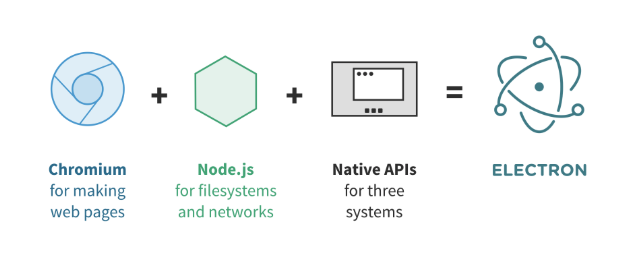

## 分享目标（2min)

- [x] 让同学们有能力从零撸一个Electron桌面应用，包括从搭建环境到打包完成的完整过程；
- [x] 了解 Electron 的一些基础概念；
- [x] 将 Electron 与自己平时的工作或者生活相结合，做一些更有意思的事情；

## Electron简单介绍(5min)

### Electron概念

#### 是什么？

Electron 是一个可以用 JavaScript、HTML 和 CSS 构建桌面应用程序的库。这些应用程序能打包到 Mac、Windows 和 Linux 系统上运行，也能上架到 Mac 和 Windows 的 App Store。

#### 由什么组成

Electron 结合了 Chromium、Node.js 和用于调用操作系统本地功能的 API（如打开文件窗口、通知、图标等）。



#### 核心理念

`Electron` 的核心理念是:保持 `Electron` 的体积小和可持续性开发。

如:为了保持 `Electron` 的小巧 (文件体积) 和可持续性开发 (以防依赖库和 API 的泛滥) ，`Electron` 限制了所使用的核心项目的数量。
比如 `Electron` 只用了 `Chromium` 的渲染库而不是其全部组件。

#### 一些历史

- 2013年4月Atom Shell 项目启动 。

- 2014年5月Atom Shell 被开源 。

- 2015年4月Atom Shell 被重命名为 Electron 。

- 2016年5月Electron 发布了 v1.0.0 版本 。

- 2016年5月Electron 构建的应用程序可上架 Mac App Store 。

- 2016年8月Windows Store 支持 Electron 构建的应用程序 。

### Electron基础架构
> Electron 与 Chromium 在架构上很相似

Chromium运行时有一个 `Browser Process`，以及一个或者多个 `Renderer Process`。

`Renderer Process` 顾名思义负责渲染Web页面。`Browser Process` 则负责管理各个 `Renderer Process` 以及其他部分（比如菜单栏，收藏夹等等），如下图：


在 Electron中，结构仍然类似，不过这里是一个 `Main Process` 管理多个 `Renderer Process`。


提问：为什么要起多个渲染进程？

而且在 `Renderer Process` 可以使用 `Node.js` 的 runtime，这就赋予来 Electron 极大的能力，以下主进程以及渲染进程可以访问到的API：


### 如何将Chromium与Node整合

能够做这个整合，首先得益于 Chromium 和 Node.js 都是基于 v8 引擎来执行 js 的，所以给了一种可能，他们是可以一起工作的。

但是有一个问题，Chromium 和 Node.js 的事件循环机制不同。我们知道，Node.js 是基于 libuv 的，Chromium 也有一套自己的事件循环方式，要让他们一起工作，就必须整合这两个事件循环机制。


如上图所示，Electron 采用了这样一种方式，它起了一个新的线程轮询 libuv 中的 backend fd，从而监听 Node.js 中的事件，一旦发现有新的事件发生，就会立即把它 post 到 Chromium 的事件循环中，唤醒主线程处理这个事件。

### electron 与 NW.js 的对比以及区别

`Electron` 的原名叫 `Atom Shell`，`NW.js`  的原名叫 `node-webkit`；

`Electron` 和 `NW.js`  起初是同一个作者开发。后来种种原因分为两个产品。一个命名为 `NW.js`(英特尔公司提供技术支持)、 另一命名为 `Electron`(Github 公司提供技术支持)。

#### 两者在GitHub上的数据对比

```
nw.js    (35.9k star,  3703 commits, 231 releases,  735 open issues,  5640 closed)
electron (77.5k star, 22613 commits, 639 releases, 1049 open issues, 10574 closed)
```
可以看出 `Electron` 更加活跃。

#### 两者程序的入口不同
在 `NW.js` 中，应用的主入口是网页或者JS脚本。 你需要在 `package.json` 中指定一个html或者js文件，一旦应用的主窗口(在html作为主入口点的情况下)或脚本被执行，应用就会在浏览器窗口打开。

在 `Electron` 中，入口是一个 `JavaScript` 脚本。 不同于直接提供一个URL，**你需要手动创建一个浏览器窗口**，然后通过 API 加载 HTML 文件。 你还可以监听窗口事件，决定何时让应用退出。

Electron 的工作方式更像 Node.js 运行时 ，Electron 的 APIs 更加底层。

#### Node 集成
在 `NW.js`，网页中的 Node 集成需要通过给 `Chromium` 打补丁来实现。但在 `Electron` 中，我们选择了另一种方式：通过各个平台的消息循环与 `libuv` 的循环集成，避免了直接在 `Chromium` 上做改动。这就意味着 `Electron` 迭代的成本更低。

## 五个小 demo(20min)

### Demo01: 搭建一个最简单的Electron

介绍
1、electron中的基础对象 `app` , `BrowserWindow`
2、与同学们当前项目结合的可能性，提高咱们产品的竞争力

### Demo02: 从零搭建一个React应用

使用webpack从零搭建一个React应用

目标
1、项目可以热更新，使用typescript约束代码、使用sass
2、打包出来的项目可以正常

### Demo03: 将 Electron 与 React 结合

目标
1、在Electron中react项目依旧可以热更新，使用typescript约束代码、使用sass


### Demo04: 打包 Electron 应用

介绍
1、简单介绍 Electron 有哪些打包工具

目标
1、打包出来的程序可以在Mac,linux,window都可以正常使用

### Demo05: 实际开发一个小 Demo

目标
1、演示主进程与渲染进程的通信


## 通过第三方库搭建Electron开发环境(2min)

1、 react:[electron-react-boilerplate](https://github.com/electron-react-boilerplate/electron-react-boilerplate)

2、 vue:[electron-vue](https://github.com/SimulatedGREG/electron-vue)

3、 angular:[angular-electron](https://github.com/maximegris/angular-electron)

## 平时开发中遇到的一些坑(3min)

1、保持应用单例

2、文件读写， 关于 `electron-builder` 配置

3、打包项目路径问题

4、官方提供的[常见问题](https://wizardforcel.gitbooks.io/electron-doc/content/faq/electron-faq.html)


## 参考链接

[Electron 文档](https://electronjs.org/docs)
[WebPack 文档](https://www.webpackjs.com/guides/)
[Electron构建跨平台应用Mac/Windows/Linux](https://juejin.im/post/5c46ab47e51d45522b4f55b1)
[awesome-electron](https://github.com/sindresorhus/awesome-electron)